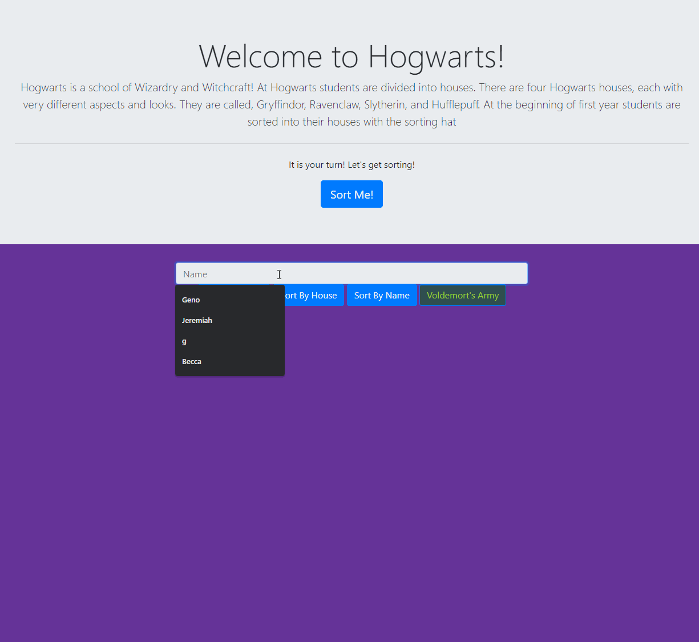

# Sorting Hat!

This project was to display everything we'd learned over the first couple weeks.  
This includes markup with html5 styling with css and bootstrap as well as javascript to work with arrays and displaying data dynamically.

The page takes a name in a bootstrap form, randomly sorts the name into a hogwarts house, and then displays the name on a card. These cards are sortable by clicking on a button for house and name.  
Each card has the option to expell the student and have them join voldemort's army. This is a separate array and is visible by clicking a separate button. 

## Preview

## Technologies Used

    

## View Project

* Clone the repository `$ git clone git@github.com:spotmonk/sorting-hat.git`
* Run any HTTP server. My favorite is installed with `$ npm install http-server` and run with a `$ hs`
